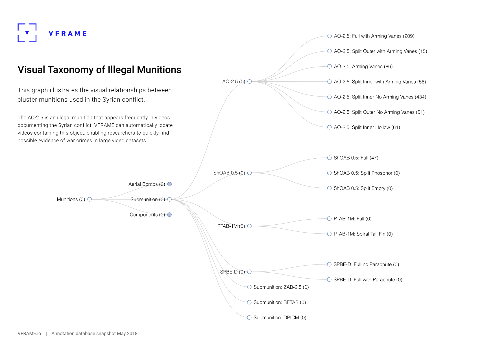

# VFRAME: Visual Forensics and Metadata Extraction



VFRAME is a computer vision framework for visual forensics and metadata extraction. It's designed for human rights technologists working with large datasets (millions) of videos and photos. 

VFRAME runs on a single workstation with NVIDIA GPU(s) and allows a single technical operator to convert large quantities of visual information into useful metadata, training new object detectors, and export data for use with external APIs or visual search engines. VFRAME image processing framework is currently designed for technologists.

VFRAME includes a utlity called [VCAT](https://github.com/vframeio/vcat) to search the metadata and can execute visual queries on 10M keyframes in less than 0.3 seconds.

**VFRAME is under daily development. This page will be updated often during Oct-December**


Demo of cluster munition detector (in progress)

Features:
 
- fast video keyframe detection using CNN feature vectors
- modular commands for integrating with OpenCV DNN, PyTorch and other image processing frameworks
- integration with Sugarcube media collection system
- integration with VCAT metadata API, visual query, and annotation system


## Getting Started

- `git clone https://github.com/vframeio/vframe`
- `conda env create -f environment.yml`
- `cd vframe`
- `python cli_vframe.py `
- If correct installed the output should look like

```
Usage: cli_vframe.py [OPTIONS] COMMAND1 [ARGS]... [COMMAND2 [ARGS]...]...

  VFRAME: Visual Forensics and Metadata Extraction

Options:
  -v, --verbose              Verbosity: -v DEBUG, -vv INFO, -vvv WARN, -vvvv
                             ERROR, -vvvvv CRITICAL  [default: 4]
  --verified / --unverified  Verified or unverified media
  --help                     Show this message and exit.

Commands:
  _template_        [blank template]
  add_data          Appends metadata to media record
  add_images        Appends images to ChairItem
  classify_cv       Generates classification metadata (OpenCV DNN)
  classify_dk       Generates classification metadata (Darknet)
  collate           Collate metadata-tree items
  convert           Converts between JSON and Pickle
  detect_cv         Generates detection metadata (CV DNN)
  detect_dk         Generates detection metadata (Darknet)
  detect_face       Generates face detection ROIs
  detect_text       Generates scene text ROIs (CV DNN)
  display           Displays images
  draw              Displays images
  dump              Writes items to disk as JSON or Pickle
  extract_features  Generates CNN features metadata (PyTorch)
  filter            Filters mapping and metadata
  find              Isolates media record ID
  keyframe_status   Generates KeyframeStatus metadata
  open              Add mappings data to chain
  print             Display info
  remove_data       Removes metadata
  remove_images     Purges media record data to free up RAM
  save_data         Write items to JSON|Pickle
  save_images       Saves keyframes for still-frame-video
  slice             Slice items
  source            Add media records items to chain
  sugarcube         Generate Sugarcube metadata
```


more instructions needed for prearing video files. things may not work right now


## TODO

October 21 - 31

- add oriented text detection polygons for EAST
- add CRNN text recognition (eng)
- add tesseract 4.0 OCR (eng, ara)
- add ROI image extraction
- intregrate FAISS build scripts from VCAT

Nov 1 - 31

- add face embedding extraction
- add options for data export to CSV for Pandas analysis
- demos for Yolo darknet training workflow
- add scripts for negative mining
- add scripts for object tracking + low-confidence detector ROI extraction
- explore options for data augmentation on aerial dataset
- develop metrics for objection detection models
- add TF OD API project builder
- add instructions for freezing/exporting TF for OpenCV compatability
- update DNN modules for OpenCV 4 (pending release)
- update image feature extractor for PyTorch 1.0
- migrate/fix keyframe detection script, integrate with PyTorch 1.0

Dec 1 - 31

- migrate JSON/Pickle (slow) to local DB (sqlite, mongo, or LMDB, hdf5)
- add pose detection test
- improve README
- give demo examples
- create demo videos
- create demo notebooks


---------------------

- VFRAME and vframe.io Copyright (c) 2017-2018 Adam Harvey
- VFRAME Phase 1 support provided by (https://prototypefund.de)[PrototypeFund.de] (German Federal Ministry of Education and Research) 
